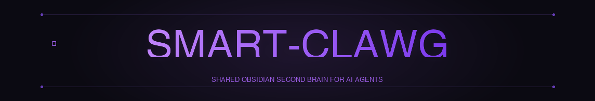

<p align="center">
  
</p>

# CLAWG

**CLAWG is an open-source personal agent framework with a native shared Obsidian Second Brain.**

Every session can load shared markdown context from one vault so all agents work from the same source of truth:

- master files (`user.md`, `environment.md`, `philosophy.md`)
- shared capabilities (`skills/`, `subagents/`, `tools/`, `api/`, `learning/`)
- per-agent profile files (`identity.md`, `AGENTS.md`, `soul.md`)

Access your context from any Claude Code session via Obsidian Sync.

## Why CLAWG

- One context runtime for all agents
- Native markdown workflow (edit in Obsidian, reuse in CLI)
- Shared tools and APIs across all agents
- Multi-agent architecture with deterministic profile loading
- Open-source and self-hostable

## Quickstart

### 1) Install

```bash
curl -fsSL https://raw.githubusercontent.com/gquthier/CLAWG/main/scripts/install.sh | bash
```

Supported: macOS, Linux, WSL2.

### 2) Link your vault

```bash
clawg second-brain link --path "/path/to/your/Second Brain"
```

### 3) Initialize templates

```bash
clawg second-brain init --agent-id founder
```

### 4) Validate path resolution

```bash
clawg second-brain status
```

### 5) Start agent session

```bash
clawg --agent-id founder
```

## Core commands

```bash
clawg
clawg setup
clawg model
clawg tools
clawg config
clawg gateway
clawg doctor
clawg update

clawg second-brain status
clawg second-brain link --path "<vault-path>"
clawg second-brain init --agent-id <id>
```

## Second Brain reference layout

```text
Second Brain/
  Large Memory/
    Projects/
  user.md
  environment.md
  philosophy.md
  api/
  learning/
  tools/
  skills/
  subagents/
  agents/
    founder/
      identity.md
      AGENTS.md
      soul.md
```

## Documentation

- Landing page source: [`landingpage/index.html`](landingpage/index.html)
- Complete setup guide: [`docs/SECOND_BRAIN_SETUP.md`](docs/SECOND_BRAIN_SETUP.md)
- Additional docs: [`docs/`](docs/)

## Development

```bash
git clone https://github.com/gquthier/CLAWG.git
cd CLAWG
python3 -m venv .venv
source .venv/bin/activate
pip install -e .
```

Run checks:

```bash
python -m pytest tests/ -q
```

## Contributing

1. Open an issue describing the change.
2. Create a branch from `main`.
3. Keep pull requests focused and testable.
4. Add docs updates when changing runtime behavior.

## License

MIT - see [`LICENSE`](LICENSE).
